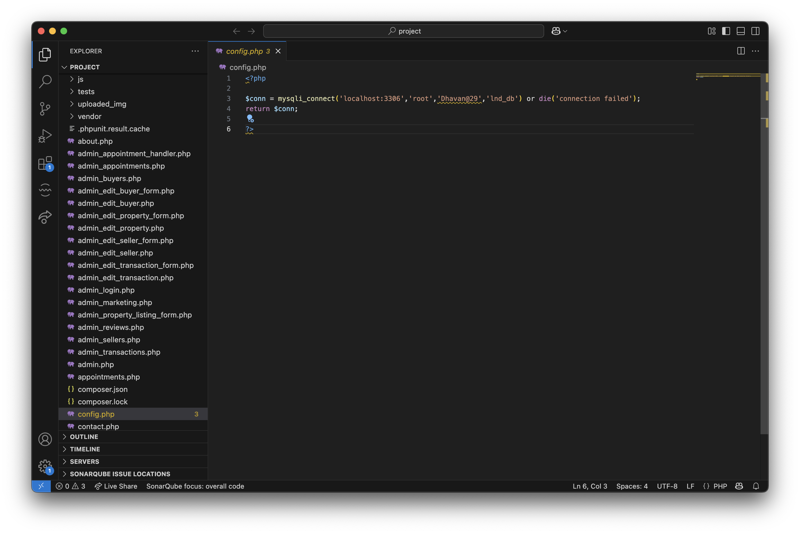

# CSI-5370-dreamhomes-website-testing
Black Box and White Box Testing of  DreamHomes Website 

## Install XAMPP

Run Apache Web Server

## Setup DataBase

Run lnd_db.sql on MySql WorkBench to get the Database with all the data and Stored Procedure

## Update config.php file to successfully connect your database

Update the Username and Password for your MySql database and the database schema name as given while creating the database.

## Website URLs

The Home page URL can be used to navigate throughout the website

http://localhost/project/home.php

The Admin page URL can be used to navigate throughout the Admin portal

http://localhost/project/admin.php

Admin Credentials - dhavanraveendranath@gmail.com
Password - Dhavan@29

