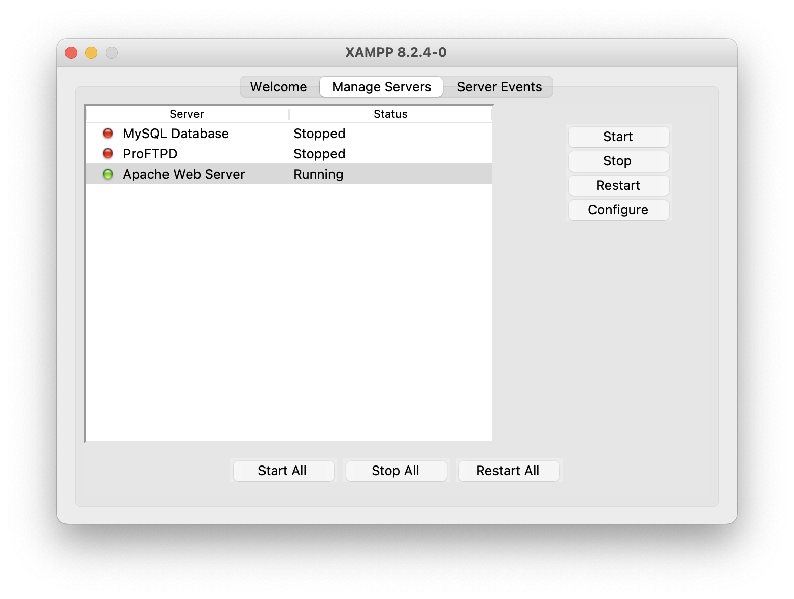

# CSI-5370-dreamhomes-website-testing
Black Box and White Box Testing of  DreamHomes Website 


## Install XAMPP

Run Apache Web Server




## Setup DataBase [IMPORTANT}

Run lnd_db.sql on MySql WorkBench to get the Database with all the data and Stored Procedure


## Update config.php file to successfully connect your database

Update the Username and Password for your MySql database and the database schema name as given while creating the database.


## Website URLs

The Home page URL can be used to navigate throughout the website

http://localhost/project/home.php


The Admin page URL can be used to navigate throughout the Admin portal

http://localhost/project/admin.php


Admin Credentials - dhavanraveendranath@gmail.com

Password - Dhavan@29


## PHP Unit Testing Setup


### Install Composer

Using HomeBrew

```bash
brew install composer
```


### Install PHPUnit via Composer

```bash
composer require --dev phpunit/phpunit
```


### Create the tests Directory

Create a folder to store your test files

```bash
mkdir tests
```


### Create a phpunit.xml in your project root:

```xml
<?xml version="1.0" encoding="UTF-8"?>
<phpunit bootstrap="vendor/autoload.php"
         colors="true"
         stopOnFailure="false">
    <testsuites>
        <testsuite name="Project Test Suite">
            <directory>./tests</directory>
        </testsuite>
    </testsuites>
</phpunit>
```


### To run PHP Unit test

To run all the tests 

```bash
vendor/bin/phpunit tests
```


To run tests individually

```bash
vendor/bin/phpunit tests/PHP_Test_File.php
```


